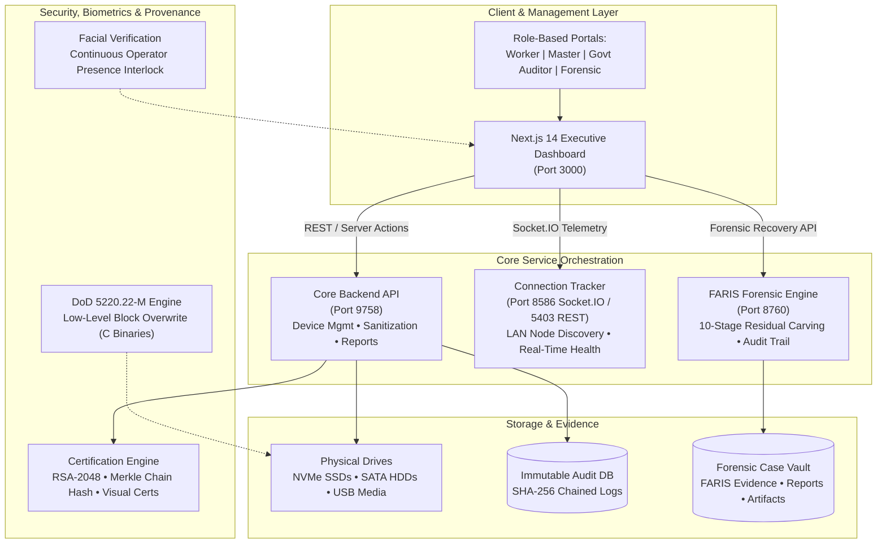

# SecureWipe Enterprise Platform
### Next-Generation Secure Storage Sanitization, Forensic Verification & Cryptographic Provenance Platform

[](https://nextjs.org/)
[](https://flask.palletsprojects.com/)
[](https://csrc.nist.gov/)
[]()
[]()

---

## 1. Executive Summary

**SecureWipe** is an enterprise-grade cyber defense and storage sanitization platform engineered for defense agencies, government departments, and certified corporate asset disposition facilities. 

The platform guarantees verifiable, non-recoverable destruction of electronic data across NVMe SSDs, SATA HDDs, and USB storage media in strict alignment with **NIST SP 800-88 Rev 1 (Clear, Purge, Destroy)** and **DoD 5220.22-M (3-Pass & 7-Pass ECE)** standards. Integrated within the platform is **FARIS (Forensic Artifact Recovery & Integrity System)**—a specialized forensic engine that independently validates the sanitization status through deep block inspection, fragment reconstruction, and zero-residual auditing.

---

## 2. System Architecture



---

## 3. Microservices & Network Port Matrix

| Service | Port | Protocol | Path / Health Endpoint | Role & Safety Classification |
| :--- | :---: | :---: | :--- | :--- |
| **Frontend Web Application** | `3000` | HTTP / WS | `http://localhost:3000/login` | **Safe**: Next.js 14 executive UI & dashboard. |
| **Core Backend API** | `9758` | HTTP | `http://127.0.0.1:9758/api/devices` | **Safe**: Device manager, wipe scheduler, history. |
| **FARIS Forensic Service** | `8760` | HTTP | `http://127.0.0.1:8760/api/faris/health` | **Safe**: Non-destructive post-wipe forensic verification. |
| **Socket.IO Connection Server** | `8586` | WebSocket | `http://127.0.0.1:8586` | **Safe**: Live client connection & event broadcasting. |
| **Connection REST API** | `5403` | HTTP | `http://127.0.0.1:5403/getConnectedUsers` | **Safe**: Query endpoint for active connected sessions. |
| **Main Boom Wipe Service** | `5695` | HTTP | `http://127.0.0.1:5695/health` | **DESTRUCTIVE**: Physical disk wiping endpoint (Off by default). |
| **Pendrive Boom Wipe Service** | `8743` | HTTP | `http://127.0.0.1:8743/health` | **DESTRUCTIVE**: USB pendrive sanitization (Off by default). |

---

## 4. Repository Directory Structure

```
secure_wiping/
├── README.md                      # Corporate architecture, ports & setup guide
├── .env.example                   # Centralized environment variable template
├── .gitignore                     # Enterprise source control exclusions
├── package.json                   # Frontend dependencies and dev scripts
├── tsconfig.json                  # TypeScript compiler settings & path aliases
├── next.config.mjs                # Next.js build and routing configuration
├── tailwind.config.ts             # Tailwind CSS tokens and layout styles
│
├── src/                           # Next.js 14 Frontend Application
│   ├── ai/                        # GenKit AI flows (wipe advisor, report generators)
│   ├── app/                       # App Router portals:
│   │   ├── (app)/                 # Core user flows (wipe, restore, FARIS recovery, history)
│   │   ├── government/            # Government auditor verification portal
│   │   ├── forensic/              # Forensic carver & analysis portal
│   │   ├── individual/            # Consumer marketplace & health valuation
│   │   ├── master/                # Master administrator oversight console
│   │   └── worker/                # Certified wiping technician operations
│   ├── components/                # Reusable Radix UI & design system components
│   ├── hooks/                     # Custom React hooks
│   ├── lib/                       # Utility helpers & crypto locks
│   └── middleware.ts              # Role-based route guard & token validation
│
├── backend/                       # Core Flask Backend Services (Port 9758)
│   ├── app.py                     # Consolidated Flask entry point
│   ├── auth.py                    # Multi-tier RBAC authentication engine
│   ├── ntro_platform_api.py       # Government NTRO compliance platform endpoints
│   ├── device_manager.py          # Physical storage detection & SMART analysis
│   ├── sanitization_engine.py     # NIST 800-88 & DoD wipe algorithm engine
│   ├── sanitization_verifier.py   # Cryptographic zero-fill verifier
│   ├── forensic_carver.py         # Signature-based raw sector carver
│   ├── storage_inspector.py       # Non-destructive physical disk hex reader
│   ├── audit_engine.py            # Chained SHA-256 tamper-proof ledger
│   ├── reporting_engine.py        # PDF, HTML, JSON audit certificate compiler
│   └── requirements.txt           # Python backend dependencies
│
├── connection-server/             # Socket.IO & LAN Discovery Server (Ports 8586 & 5403)
│   ├── start_servers.py           # Dual-server supervisor script
│   ├── main_server.py             # Socket.IO client event handler (Port 8586)
│   └── api_server.py              # REST query API for active clients (Port 5403)
│
├── FARIS/                         # Forensic Artifact Recovery & Integrity System (Port 8760)
│   ├── acquisition/               # Bit-stream image acquisition (E01 / raw)
│   ├── analysis/                  # Filesystem reconstruction & slack analyzer
│   ├── application/
│   │   ├── faris_api.py           # Core FARIS forensic pipeline interface
│   │   └── faris_service.py       # HTTP REST Adapter (Port 8760)
│   ├── core/                      # Case manager, dynamic path resolver & telemetry
│   ├── recovery/                  # 10-stage residual carving & adaptive engines
│   ├── validation/                # Ground-truth recovery benchmark validator
│   ├── cases/                     # Active forensic cases & live evidence vault
│   └── tests/                     # Validation test suites with 43 pre-built forensic cases
│
├── services/                      # Modular Business Services
│   ├── certification/             # PKI digital certificates, RSA-2048 keys & Merkle trees
│   └── facial_recognition/        # Biometric visual monitoring (OpenCV & embeddings)
│
├── tools/                         # Low-Level System Binaries
│   └── dod_wiping/                # C source & compiled DoD 5220.22-M block wiper
│
├── tests/                         # Test Fixtures & Sandboxes
│   └── sandbox/                   # Synthetic mock targets & carving test images
│
├── scripts/                       # DevOps & Orchestration Scripts
│   ├── start_services.ps1         # 1-Click launcher for all safe development services
│   ├── stop_services.ps1          # Graceful shutdown script for all service ports
│   └── check_services.ps1         # Instant socket health & endpoint diagnostic
│
└── docs/                          # Technical Documentation
    └── START_SERVICES.md          # Multi-terminal developer guide & safety notice
```

---

## 5. Quickstart & Service Management

### Prerequisites
- **Operating System**: Windows 10/11 (64-bit)
- **Runtime Environments**: Python 3.10+ and Node.js 18+
- **Shell**: PowerShell 5.1 or PowerShell 7+

### 1-Click Service Startup
Run the automated service orchestrator from the repository root:
```powershell
powershell -ExecutionPolicy Bypass -File .\scripts\start_services.ps1
```

### Health Check Diagnostic
Inspect the live status of all system components:
```powershell
powershell -ExecutionPolicy Bypass -File .\scripts\check_services.ps1
```

### Service Shutdown
Cleanly stop all background service processes:
```powershell
powershell -ExecutionPolicy Bypass -File .\scripts\stop_services.ps1
```

---

## 6. Security Standards Compliance

- **NIST SP 800-88 Rev 1**: Full lifecycle support for **Clear** (logical overwrite), **Purge** (cryptographic erase & multi-pass overwrite), and physical destruction verification.
- **DoD 5220.22-M**: 3-Pass Overwrite (`0x00`, `0xFF`, Pseudo-Random) with readback verification.
- **DoD 5220.22-M ECE**: 7-Pass extended overwrite protocol for magnetic and legacy media.
- **Forensic Zero-Tolerance**: Validated with FARIS 10-stage forensic sweep ensuring 0 recoverable artifacts before certificate issuance.
- **Cryptographic Provenance**: Every wiping event creates an immutable SHA-256 chained audit record signed with an RSA-2048 private key.
